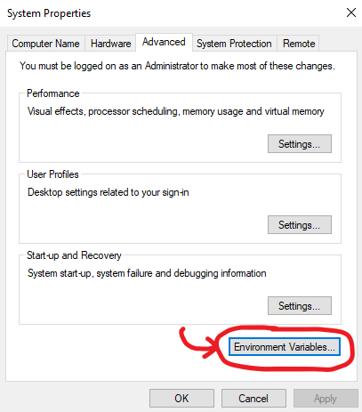
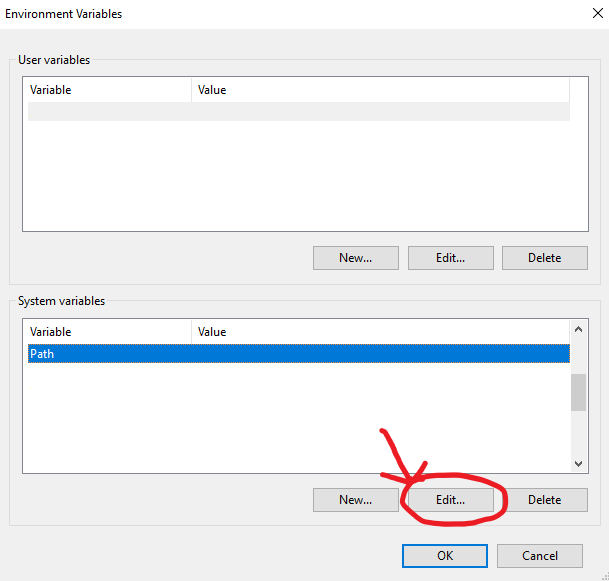
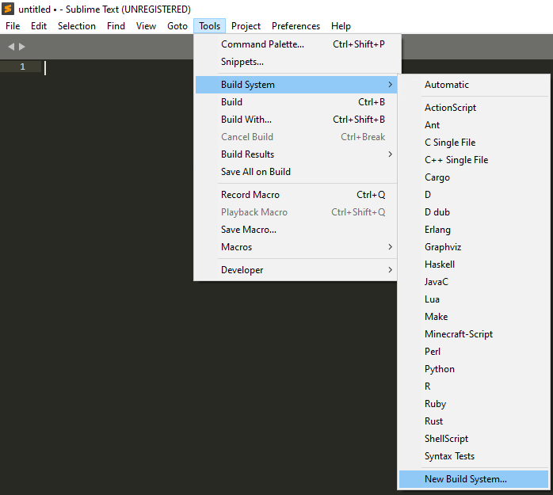
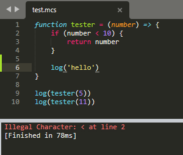

# Installations
This page is mainly for making the usage of MCS easier.

## Python
Minecraft Script is a Python package, requiring Python 3 to work.
Note that the package hasn't been tested for Python versions older than
Python 3.8, so getting the latest version is recommended.
Python can be downloaded [here](https://www.python.org/downloads/).

## Command Line
If you're using Windows, you can add a keyword to your command line to ease the usage of commands.
In the following command, I'll be using ``mcs`` to replace ``python -m minecraft_script``.

To get started, make a file with the ``.cmd`` extension. Since we want ``mcs`` as the keyword,
the file's name should be ``mcs.cmd``. Inside this file, paste the following code:
```cmd
@echo off
python -m minecraft_script %*
@echo on
```
_Note: The ``%*`` here represents the arguments that follow the keyword._

Now, all that's left to do is to add the file to the ``path`` environment variable.
This can be done by first opening the System Properties video
(You can either search for "Environment Variables" or go to ``Settings > System > About > Advanced System Settings``).
Once you've reached this point, click on ``Environment Variables`` (shown in image below).



In the new window, under ``System variables``, click on ``Path``, and then the edit button.



In the edit window, click on ``New`` and put the full path of the parent folder of the ``.cmd`` file you made.
For instance, if your mcs file is located in ``D:/shell_commands/mcs.cmd``, you should write ``D:/shell_commands/``.

To finish this up, click on ``OK``, then ``OK`` (again) and you can close out of any open windows.

The setup should now be complete. To test out if it works, you can type ``mcs help`` in the command line.

Have fun!


## Sublime Text
MCS doesn't have its own custom syntax highlighter.
However, using JavaScript's syntax highlighter can be used as a suitable replacement.

As for interpreting the code you made, Sublime Text supports user-made builds,
which allows for interpreting MCS code by "building" (default keybind: Ctrl + B).

To add a custom build for MCS, copy the following code into a file with the ``.sublime-build`` extension,
and place it into Sublime Text's User package folder manually
(default location: ``%appdata% > Roaming > Sublime Text > Packages > User ``)
or by using Sublime Text and clicking on ``Tools > Build System > New Build System...``.
```json
{
    "target": "ansi_color_build",
    "syntax": "Packages/ANSIescape/ANSI.sublime-syntax",
    "cmd": ["python", "-m", "minecraft_script", "run", "$file"],
    "file_patterns": ["*.mcs"]
}
```


_Note: Don't forget to save the file after pasting the code into it!_

As can be observed in the build system file, it is highly recommended you used [ANSIescape](https://github.com/aziz/SublimeANSI/).
This is so errors get their colors in the sublime text panel. If you don't have ANSIescape installed,
all you need to do is hit ``Ctrl + Shift + P``, type ``package control: install package``,
and search for "ANSIescape". Sublime Text should automatically download and install everything automatically.

Hitting ``Ctrl + B`` when inside a .mcs file should now automatically interpret the code and output the result to
Sublime's console.



_Minecraft-Script during active programming_
